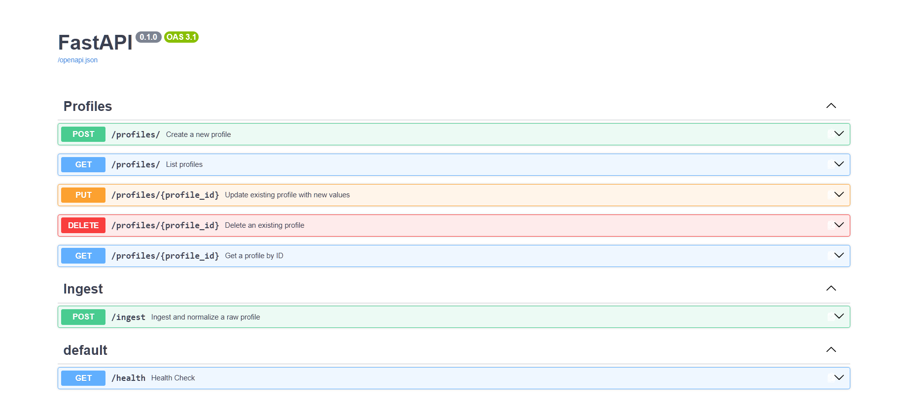
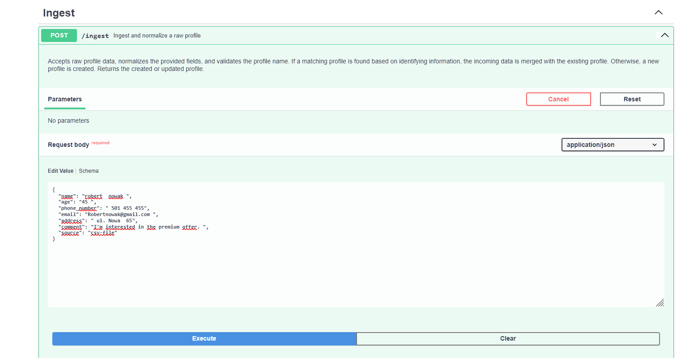
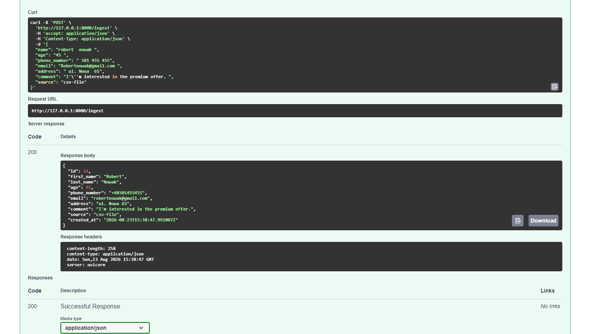
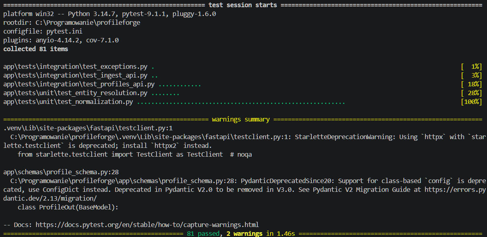

# ProfileForge

ProfileForge is a data integration API built with FastAPI and PostgreSQL. It takes inconsistent profile data from different sources, normalizes it, detects duplicate records, and merges them into a single canonical profile.

**FastAPI · PostgreSQL · SQLAlchemy · Docker · Alembic · Pytest**

## What it does

ProfileForge accepts profile data that may differ in formatting, completeness, and structure between sources.

The `/ingest` endpoint:

1. normalizes incoming data,
2. checks whether the profile already exists,
3. matches profiles using email, phone number, or fuzzy name matching,
4. merges missing information into an existing profile or creates a new one.

The project also provides a CRUD API for managing already-clean profiles.

## Architecture

```text
profileforge/
├── app/
│   ├── api/
│   │   ├── routes_ingest.py       # Data ingestion pipeline
│   │   └── routes_profiles.py     # Profile CRUD endpoints
│   │
│   ├── core/
│   │   ├── config.py              # Environment-based configuration
│   │   ├── exceptions.py          # Global exception handling
│   │   └── logging_config.py      # Application logging
│   │
│   ├── database/
│   │   ├── base.py                # SQLAlchemy Base
│   │   └── session.py             # PostgreSQL engine and sessions
│   │
│   ├── models/
│   │   └── profile_model.py       # SQLAlchemy Profile model
│   │
│   ├── schemas/
│   │   ├── ingest_schema.py       # Raw input schema
│   │   └── profile_schema.py      # Profile request/response schemas
│   │
│   ├── services/
│   │   ├── normalization.py       # Data normalization
│   │   ├── entity_resolution.py   # Duplicate detection and merging
│   │   └── profile_service.py     # Database operations
│   │
│   └── tests/
│       ├── unit/
│       └── integration/
│
├── alembic/                       # Database migrations
├── docs/
│   ├── data_model.md              # Raw and canonical data model
│   ├── entity_resolution.md       # Matching and merge rules
│   └── screenshots/               # API, tests and Docker screenshots
│
├── docker-compose.yml
├── Dockerfile
├── requirements.txt
├── requirements-dev.txt
└── pytest.ini
```

The application is separated into API, service, database, schema, and model layers. This keeps the endpoint logic focused on orchestration while normalization, entity resolution, and database operations remain independently testable.

## Tech stack

- **Python 3.14**
- **FastAPI** - REST API
- **Pydantic** - request/response validation
- **SQLAlchemy** - ORM and database access
- **PostgreSQL 16** - relational database
- **Alembic** - database migrations
- **RapidFuzz** - fuzzy name matching
- **phonenumbers** - phone number normalization
- **Pytest + pytest-cov** - testing and coverage
- **Ruff + Black** - code quality and formatting
- **Docker + Docker Compose** - reproducible local environment
- **Git** - version control

## How requirements map to this project

| Requirement | Where it is demonstrated |
|---|---|
| **Python** | Application code in `app/`, including API routes, services, database layer and tests |
| **REST API development** | `app/api/routes_ingest.py`, `app/api/routes_profiles.py` |
| **Data processing / transformation** | `app/services/normalization.py` |
| **Profile / entity processing** | `app/services/entity_resolution.py` - `find_matching_profile()` and `merge_profiles()` |
| **SQL / relational databases** | PostgreSQL configuration in `app/database/session.py`, SQLAlchemy model in `app/models/profile_model.py`, queries in `app/services/profile_service.py` |
| **Data validation** | Pydantic schemas in `app/schemas/` |
| **Testing** | `app/tests/unit/` and `app/tests/integration/` |
| **Database migrations** | `alembic/` |
| **Docker** | `Dockerfile` and `docker-compose.yml` |
| **API documentation** | FastAPI-generated OpenAPI/Swagger documentation |
| **Code quality** | Ruff configuration in `pyproject.toml`, Black formatting and linting workflow |
| **Git** | Incremental, milestone-based commits — see Development Workflow section below |

## Design decisions

### Separate normalization from entity resolution

Normalization and entity resolution are implemented as separate services:

- `app/services/normalization.py`
- `app/services/entity_resolution.py`

This keeps data cleaning independent from the logic responsible for deciding whether two records represent the same person.

### Matching priority

Entity resolution uses the following order:

1. exact normalized email,
2. exact normalized phone number,
3. fuzzy first and last name matching with a **90% threshold**.

Email and phone are treated as stronger identifiers than names. The full reasoning is documented in [`docs/entity_resolution.md`](docs/entity_resolution.md).

### Merge strategy

When an existing profile is matched, the system **fills missing values without overwriting existing data**.

For example:

```text
Existing:
email = "jan@example.com"
phone_number = None

Incoming:
email = "other@example.com"
phone_number = "+48123456789"

Result:
email = "jan@example.com"
phone_number = "+48123456789"
```

This is an intentional simplification for the first version. The system currently does not have enough information to determine which conflicting value is more trustworthy.

### Required address

`address` is required in the canonical profile model because the project is designed around profile data that can be used in workflows where a physical address may be required, for example delivery or customer operations.

## Getting started - Docker

### 1. Clone the repository

```bash
git clone <repository-url>
cd profileforge
```

### 2. Create the environment file

```bash
copy .env.example .env
```

On Linux/macOS:

```bash
cp .env.example .env
```

Update the values in `.env` if necessary.

### 3. Start the application and databases

```bash
Docker compose up -d --build
```

This starts:

- FastAPI application
- PostgreSQL database
- separate PostgreSQL test database

### 4. Open the API documentation

Open:

```text
http://localhost:8000/docs
```

The Swagger UI provides an interactive way to test the available endpoints.



## Getting started - manual/local

### 1. Create and activate a virtual environment

```bash
python -m venv .venv
```

Windows:

```bash
.venv\Scripts\activate
```

Linux/macOS:

```bash
source .venv/bin/activate
```

### 2. Install dependencies

```bash
pip install -r requirements.txt
pip install -r requirements-dev.txt
```

### 3. Configure environment variables

Create `.env` based on `.env.example` and make sure PostgreSQL is running.

For a local setup, the application expects PostgreSQL on port `5432`.

### 4. Apply database migrations

```bash
alembic upgrade head
```

### 5. Start the application

```bash
uvicorn app.main:app --reload
```

The API will be available at:

```text
http://localhost:8000
```

Swagger documentation:

```text
http://localhost:8000/docs
```

## API usage example

The `/ingest` endpoint accepts unnormalized profile data.

### Input

```bash
curl -X POST "http://localhost:8000/ingest" \
  -H "accept: application/json" \
  -H "Content-Type: application/json" \
  -d '{
  "name": "robert  nowak ",
  "age": "45 ",
  "phone_number": " 501 455 455",
  "email": "Robertnowak@gmail.com ",
  "address": " ul. Nowa  65",
  "comment": "I'm interested in the premium offer. ",
  "source": "csv-file"
}'
```

### Result

The input is converted into the canonical profile format:

```json
{
  "id": 14,
  "first_name": "Robert",
  "last_name": "Nowak",
  "age": 45,
  "phone_number": "+48501455455",
  "email": "robertnowak@gmail.com",
  "address": "ul. Nowa 65",
  "comment": "I'm interested in the premium offer.",
  "source": "csv-file",
  "created_at": "2026-08-23T15:38:47.991007Z"
}
```

The same endpoint also handles duplicate detection. If a matching profile already exists, the incoming data is merged into that profile instead of creating another record.

### Request in Swagger



### Normalized response



## Running tests

Run the complete test suite with:

```bash
pytest
```

For coverage:

```bash
pytest --cov=app --cov-report=term-missing
```

The current test suite contains **81 tests**, covering both unit-level data processing and integration-level API behavior.



The integration tests use a separate PostgreSQL database so application data and test data remain isolated.

## Docker setup

The project uses Docker Compose to run the application together with PostgreSQL databases.

```text
FastAPI
   │
   ▼
PostgreSQL
```

A separate PostgreSQL instance is exposed on port `5433` for integration tests.

```text
docker-compose.yml
├── db        → PostgreSQL application database
├── test_db   → PostgreSQL test database
└── app       → FastAPI application
```


## Known limitations

The current implementation intentionally keeps the matching logic simple.

- **Single-word names:** `split_full_name()` treats the last word as the last name, so a single-word input results in an empty `first_name`.
- **Fuzzy matching scalability:** `find_matching_profile()` currently loads all profiles into memory before performing fuzzy matching. This approach is suitable for a small project but would not scale well to a large dataset.
- **Conflicting data:** existing values are never overwritten, even when the incoming value might be more recent or accurate.
- **Shared identifiers:** a shared email address or phone number can lead to a false positive match.
- **Migration startup:** database migrations are not automatically executed when the application container starts. Migrations are currently applied explicitly with `alembic upgrade head`.
- **Input semantics:** some required fields are validated structurally but not semantically. For example, an empty string can technically satisfy a non-null database column.

These limitations are documented in more detail in [`docs/entity_resolution.md`](docs/entity_resolution.md).

## Development workflow

Development was performed on the `main` branch, with changes grouped into milestone-focused commits using the `type: description` convention.

Examples from the project history include:

```text
feat: implement entity resolution (duplicate detection and merging) with tests
test: add integration tests for ingest and profiles API endpoints
build: add full Docker Compose stack for app and database
style: apply black formatting and fix ruff lint warnings
chore: configure Ruff linting
```

The workflow was incremental: each milestone added a specific part of the system, followed by testing, cleanup, and verification before moving to the next stage.

This made it possible to build the project step by step while keeping the changes traceable in Git history.
